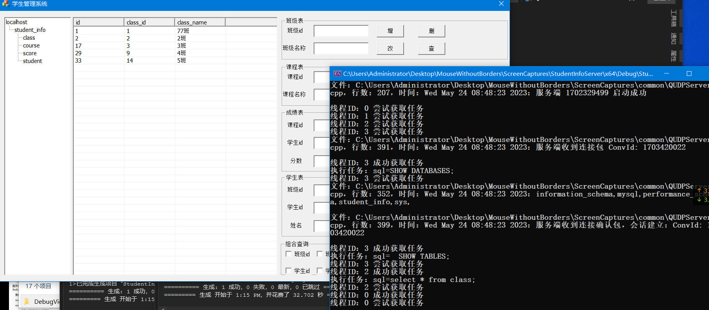
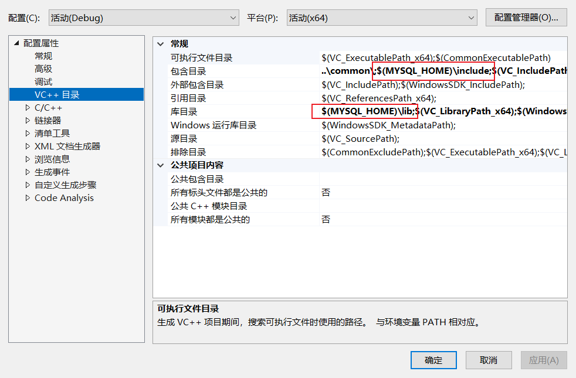
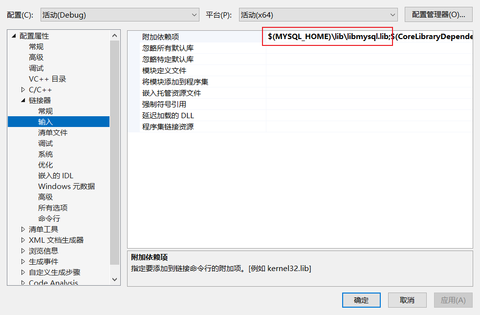

# 学生信息管理系统

使用 Socket UDP 协议实现可靠传输，线程池、连接池、MySQL 8.0 和 MFC 框架完成的学生管理系统。

如何使用：

1. 使用 VS 2022 C++ 20 编译。

2. 编译环境必须要有 MySQL 头文件和 lib 以及 DLL，否则会报找不到头文件错误。

3. 配置 MYSQL_HOME 为MySQL的安装目录。
    我的配置参考如下：MYSQL_HOME = `C:\Users\Administrator\Downloads\Programs\mysql-8.0.33-winx64`

4. mysql.dll 要在系统目录下，或者在程序运行目录下，复制 mysql.dll 到`C:\\Windows\\System32` 或 当前客户端运行目录下。

    

    

5. 最后将 `student_info.sql` 导入到 MySQL 中。